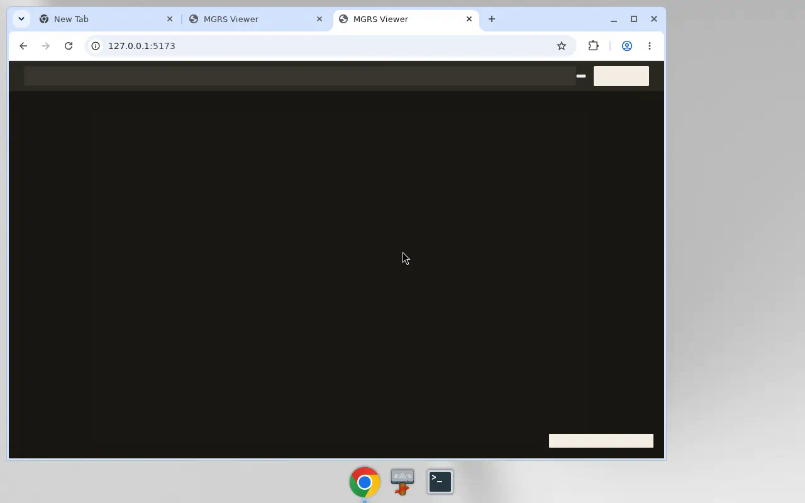
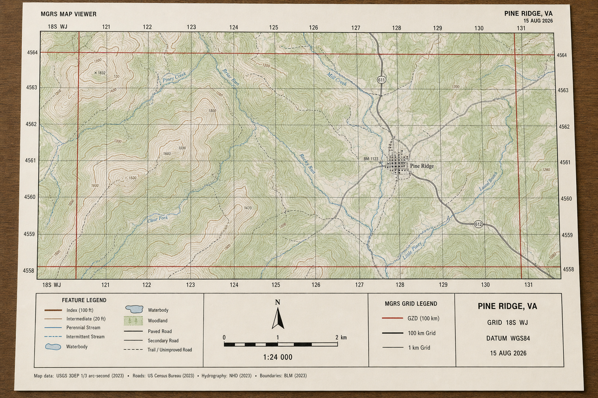

Download [MGRS-Viewer-0.1.0-linux.AppImage](https://github.com/branpurn/mgrs-map-viewer/releases/tag/v0.1.0), [MGRS-Viewer-0.1.0-win.zip](https://github.com/branpurn/mgrs-map-viewer/releases/tag/v0.1.0), [MGRS-Viewer-0.1.0-mac-arm64.zip](https://github.com/branpurn/mgrs-map-viewer/releases/tag/v0.1.0) (Apple chip, no Rosetta), or [MGRS-Viewer-0.1.0-mac-x64.zip](https://github.com/branpurn/mgrs-map-viewer/releases/tag/v0.1.0) (Intel Mac). Double-click. [Install](docs/install.md).
Self-host for a tunnel: http://localhost:18764

If it does not open:

- Double-click MGRS-Viewer-0.1.0-linux.AppImage.
- Right-click the AppImage, Properties, Permissions, Allow executing file as program.
- Tunnel: http://localhost:18764

MGRS Viewer is a browser tool for field and planning work.

Search a Military Grid Reference, lat/long, or a place name. The map
shows an MGRS grid over topographic tiles. Set the frame, then print
a US Letter (8.5 × 11 in) sheet with scale, grid spec, and a title block.

No account. Scale follows zoom. Tiles are OpenTopoMap, with OpenStreetMap
as fallback. Not an official USGS or military product. Verify in the field.

## Search formats

| Kind | Example |
|---|---|
| MGRS 100 m | `18T WK 8712 0415` |
| MGRS 1 km | `18T WK 871 041` |
| MGRS 10 km | `18T WK 87 04` |
| Lat, long | `38.889, -77.035` |
| DMS | `38°53′20″N 77°02′06″W` |
| Place | `Arlington VA` |

Compact MGRS (`18TWK87120415`) is accepted. Enter submits. Esc clears.

## Print

1. Search a grid or place.
2. Pan and zoom. The map moves under a fixed dashed US Letter frame.
3. Print. The browser prints that frame as an 8.5 × 11 in sheet.

See [docs/print-howto.md](docs/print-howto.md).

## Chrome

Toolbar label is **Sheet**. On is the Letter sheet. Off is the full map. Default On. Print is still Letter either way.

## Tiles and attribution

OpenTopoMap is the base. OpenStreetMap tiles are the fallback.
Print the credit on the sheet. Required links stay on the line.

OpenTopoMap: Map data © OpenStreetMap contributors https://www.openstreetmap.org/copyright, SRTM. Style © OpenTopoMap (CC-BY-SA) opentopomap.org. Not a USGS map. Not for navigation.

OpenStreetMap fallback: Map data © OpenStreetMap contributors https://www.openstreetmap.org/copyright. Not a USGS map. Not for navigation.

Hit the public tile servers directly. Do not proxy tile.openstreetmap.org.

## Team only

Preview: https://branpurn.github.io/mgrs-map-viewer/

Repo: https://github.com/branpurn/mgrs-map-viewer

Local stack (Vite :5173 + API :8000):

    make dev

That is the Infra path. App: http://localhost:5173

Frontend only:

Install dependencies, then start the dev server on port 5173:

    npm install
    npm run dev

Dev server: http://localhost:5173 (bound to 0.0.0.0).

    npm run build
    npm run preview

## Search and convert

Copy env.example to a local env file. Set VITE_API_BASE if a backend is available.

When set, the viewer calls:

- GET {base}/api/search?q= for place names that are not coordinates
- GET {base}/api/convert?lat=&lon=&precision= on moveend

Leave it empty to stay local-only. MGRS and decimal lat/long still parse in the browser.
Place names are not geocoded without the API.

## Stack

- Vite + vanilla HTML / JS / CSS
- MapLibre GL JS
- mgrs (local forward / toPoint)
- OpenTopoMap raster tiles
- OpenStreetMap fallback

No auth. Package name: mgrs-map-viewer.

UI strings: [strings.json](strings.json). Copy sheet: [copy-sheet-v1.md](copy-sheet-v1.md).
